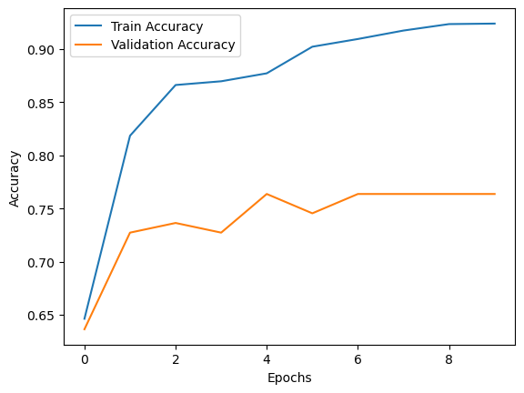
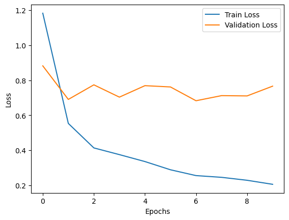

# Tree Leaf Recognition Using Image Processing

## 1. Project Overview

This project aims to develop a Python-based system that accurately recognizes and classifies tree species using leaf images. Additionally, the system detects whether a leaf is healthy or diseased, enhancing its potential applications in ecology, forestry, and biodiversity conservation.

This is the 11 species of leaves the model can recognize : 
Mango
Arjun 
Alstonia Scholaris 
Gauva 
Jamun 
Jatropha
Pongamia Pinnata 
Basil 
Pomegranate 
Lemon 
Chinar

To train my model, I used this dataset, which contains images of healthy and diseased leaves of these species : https://drive.google.com/file/d/1UyOY0bVCd_K3uIrHd-9mTMubu8ZoGyB5/view?usp=drive_link 

### Key Objectives:
- **Tree Species Identification**: Classify leaves into corresponding species.
- **Disease Detection**: Differentiate between healthy and diseased leaves.
- **Accessibility**: Provide a tool for both experts and non-experts in tree identification.

### Use Cases:
- **Ecological Research**: Fast species identification for biodiversity studies.
- **Forest Management**: Monitor environmental health by detecting diseased leaves.
- **Educational Tool**: Assist students and researchers in learning tree species identification.

---

## 2. Source Code

### Project Structure:

### Project Structure

- **/project-root**  
  - **/model**: File containig the pre-trained model
      - **modele_feuille.h5**: Model  pre-trained
  - **/code**: contains the different code
      - **training_code.py**: it's the code used for trained the model
      - **application_code.py**: it's the main code using the pre-trained model to make the tree leaf recognition
  - **requirements.txt**: Python dependencies  
  - **README.md**: Project documentation  


---

## 3. Performance Metrics

### For the training of the model (training_code)

#### Achievements:
- **Tree Species Classification and Disease Detection Accuracy**: 82% on the test dataset.
- **Speed**: Total time of the training: ~ 4 hours (24 minutes per Epochs).
- **RAM used**: ~ 5GB for the training
- **Memory Efficiency**: Model size: 11 Mo.

#### Visualizations:
- **Accuracy Over Epochs**  
  
- **Loss Over Epochs**  
    


### For the use of the model (application_code)

#### Achievements:
- **Speed**: Total time of the execution of the code for 1 image: ~ 15 seconds.
- **RAM used**: ~ 5GB 
- **Memory Efficiency**: Model size: 11 Mo.


---

## 4. Installation and Usages


---

## 5. References and Documentation

This project uses the following technologies and libraries:
- [TensorFlow](https://www.tensorflow.org/) with MobileNetV2 architecture

Additional reading:
- [Image Classification with Deep Learning](https://www.tensorflow.org/tutorials/images/classification)

---

## 6. Issues and Contributions

### Known Issues:
- **Low-Quality Images**: Model accuracy decreases with blurry or noisy images.
- **Dataset Imbalance**: Limited samples for certain species or diseased leaves.

### How to Contribute:
1. Fork the repository.
2. Create a new branch:
   ```bash
   git checkout -b feature/new-feature


